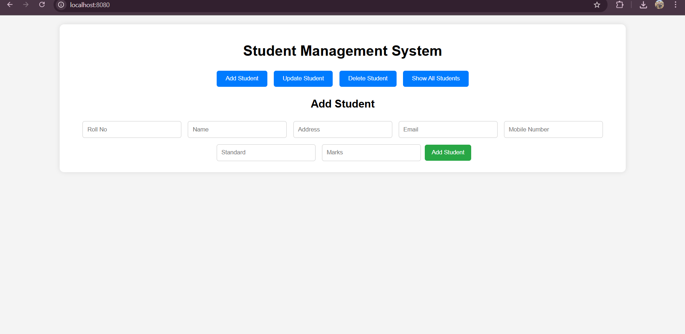

# StudentManagement System Using Rest API

Meam Members :
1. Girish Pawar (Team Leader)                                                          
Mail-ID : girishpawar1512@gmail.com

2. Ziyan Kazi                                                                                                  
Mail-ID : ziyankazi007@gmail.com

A simple full-stack **Student Management System** built with:

- 🧩 **Backend**: Spring Boot (Java)
- 🌐 **Frontend**: HTML, CSS, JavaScript
- 💾 **Database**: PostgreSQL

---

## 🔧 Technologies Used

| Layer     | Technology                                     |
|-----------|------------------------------------------------|
| Backend   | Java, Spring Boot, Spring Web, Spring Data JPA |
| Frontend  | HTML, CSS, JavaScript                          |
| Database  | PostgreSQL                                     |
| Tools     | Maven, Postman, VSCode, IntelliJ               |

---

## 📁 Project Structure

---

## 📸 Frontend Features

- Navigation menu with 4 options:
  - Add Student
  - Update Student
  - Delete Student
  - Show All Students
- Dynamic section display
- Form validation (can be extended)
- Responsive table view

---

## ✅ Advantages 
1. Easy to manage student records.
2. Saves time and reduces manual work.
3. Keeps data safe and accurate.   
4.Quickly tracks student performance.

---

## 📁 Project Structure

